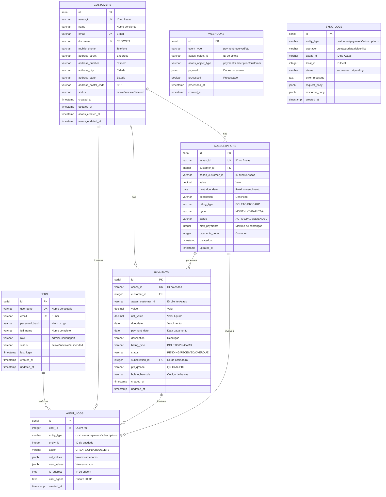

# 📊 DER - Diagrama Entidade-Relacionamento

## Banco de Dados PostgreSQL - Subscrivery

---

## 🔷 Diagrama ER (Mermaid)



---

## 🔗 Relacionamentos Detalhados

### **1. CUSTOMERS → PAYMENTS (1:N)**

```
┌──────────────┐         ┌──────────────┐
│  CUSTOMERS   │ 1     N │   PAYMENTS   │
│              ├─────────┤              │
│  id (PK)     │         │  customer_id │
└──────────────┘         └──────────────┘
```

**Descrição:**
- Um cliente pode ter vários pagamentos
- Cada pagamento pertence a um único cliente

**Chaves:**
- `customers.id` (PK) → `payments.customer_id` (FK)

**Regra:**
- `ON DELETE RESTRICT` - Não permite deletar cliente com pagamentos

---

### **2. CUSTOMERS → SUBSCRIPTIONS (1:N)**

```
┌──────────────┐         ┌──────────────────┐
│  CUSTOMERS   │ 1     N │  SUBSCRIPTIONS   │
│              ├─────────┤                  │
│  id (PK)     │         │  customer_id     │
└──────────────┘         └──────────────────┘
```

**Descrição:**
- Um cliente pode ter várias assinaturas
- Cada assinatura pertence a um único cliente

**Chaves:**
- `customers.id` (PK) → `subscriptions.customer_id` (FK)

**Regra:**
- `ON DELETE RESTRICT` - Não permite deletar cliente com assinaturas

---

### **3. SUBSCRIPTIONS → PAYMENTS (1:N)**

```
┌──────────────────┐         ┌──────────────┐
│  SUBSCRIPTIONS   │ 1     N │   PAYMENTS   │
│                  ├─────────┤              │
│  id (PK)         │         │subscription_id│
└──────────────────┘         └──────────────┘
```

**Descrição:**
- Uma assinatura pode gerar vários pagamentos (recorrência)
- Cada pagamento pode estar associado a uma assinatura (opcional)

**Chaves:**
- `subscriptions.id` (PK) → `payments.subscription_id` (FK)

**Regra:**
- Relacionamento opcional (subscription_id pode ser NULL)
- Pagamentos avulsos não têm subscription_id

---

### **4. USERS → AUDIT_LOGS (1:N)**

```
┌──────────────┐         ┌──────────────┐
│    USERS     │ 1     N │ AUDIT_LOGS   │
│              ├─────────┤              │
│  id (PK)     │         │  user_id     │
└──────────────┘         └──────────────┘
```

**Descrição:**
- Um usuário pode realizar várias ações auditadas
- Cada log de auditoria registra qual usuário fez a ação

**Chaves:**
- `users.id` (PK) → `audit_logs.user_id` (FK)

**Regra:**
- `ON DELETE SET NULL` - Se usuário deletado, mantém log com user_id = NULL

---

### **5. CUSTOMERS/PAYMENTS/SUBSCRIPTIONS → AUDIT_LOGS (1:N)**

```
┌──────────────┐         ┌──────────────┐
│  ENTIDADES   │ 1     N │ AUDIT_LOGS   │
│              ├─────────┤              │
│  id (PK)     │         │  entity_id   │
└──────────────┘         └──────────────┘
                         │  entity_type │
                         └──────────────┘
```

**Descrição:**
- Cada entidade (customer, payment, subscription) pode ter várias auditorias
- `entity_type` identifica qual tabela
- `entity_id` identifica qual registro

**Regra:**
- Relacionamento polimórfico via entity_type + entity_id

---

## 📋 Cardinalidade Resumida

| Relacionamento | Cardinalidade | Descrição |
|----------------|---------------|-----------|
| CUSTOMERS → PAYMENTS | 1:N | Um cliente, vários pagamentos |
| CUSTOMERS → SUBSCRIPTIONS | 1:N | Um cliente, várias assinaturas |
| SUBSCRIPTIONS → PAYMENTS | 1:N | Uma assinatura, vários pagamentos |
| USERS → AUDIT_LOGS | 1:N | Um usuário, várias ações |
| ENTITIES → AUDIT_LOGS | 1:N | Uma entidade, vários logs |

---

## 🔑 Chaves do Banco

### **Chaves Primárias (PK)**
```
customers.id
payments.id
subscriptions.id
webhooks.id
sync_logs.id
users.id
audit_logs.id
```

### **Chaves Estrangeiras (FK)**
```
payments.customer_id        → customers.id
payments.subscription_id    → subscriptions.id (opcional)
subscriptions.customer_id   → customers.id
audit_logs.user_id          → users.id (opcional)
```

### **Chaves Únicas (UK)**
```
customers.asaas_id
customers.email
customers.document
payments.asaas_id
subscriptions.asaas_id
users.username
users.email
```

---

## 🎨 Diagrama Visual ASCII

```
                                SUBSCRIVERY - DATABASE
                                =======================

┌─────────────────────────────────────────────────────────────────────────────┐
│                                                                             │
│                              ┌─────────────┐                                │
│                              │   USERS     │                                │
│                              │ ─────────── │                                │
│                              │ id (PK)     │                                │
│                              │ username    │                                │
│                              │ email       │                                │
│                              │ role        │                                │
│                              └──────┬──────┘                                │
│                                     │                                       │
│                                     │ 1:N                                   │
│                                     ↓                                       │
│                              ┌─────────────┐                                │
│                              │ AUDIT_LOGS  │                                │
│  ┌─────────────┐             │ ─────────── │                                │
│  │  CUSTOMERS  │             │ id (PK)     │                                │
│  │ ─────────── │             │ user_id(FK) │                                │
│  │ id (PK)     │             │ entity_type │                                │
│  │ asaas_id    │             │ entity_id   │                                │
│  │ name        │             │ action      │                                │
│  │ email       │             └─────────────┘                                │
│  │ document    │                                                            │
│  │ status      │                                                            │
│  └──────┬──────┘                                                            │
│         │                                                                   │
│         │ 1:N                                                               │
│         ├──────────────┐                                                    │
│         │              │                                                    │
│         ↓              ↓                                                    │
│  ┌─────────────┐  ┌──────────────────┐                                     │
│  │  PAYMENTS   │  │  SUBSCRIPTIONS   │                                     │
│  │ ─────────── │  │ ──────────────── │                                     │
│  │ id (PK)     │  │ id (PK)          │                                     │
│  │ asaas_id    │  │ asaas_id         │                                     │
│  │customer_id  │◄─┤ customer_id (FK) │                                     │
│  │   (FK)      │  │ value            │                                     │
│  │ value       │  │ next_due_date    │                                     │
│  │ due_date    │  │ cycle            │                                     │
│  │ status      │  │ status           │                                     │
│  │subscription │  │ payments_count   │                                     │
│  │  _id (FK)   │◄─┘                  │                                     │
│  └─────────────┘  └──────────────────┘                                     │
│                            1:N                                              │
│                                                                             │
│  ┌─────────────┐                    ┌─────────────┐                        │
│  │  WEBHOOKS   │                    │ SYNC_LOGS   │                        │
│  │ ─────────── │                    │ ─────────── │                        │
│  │ id (PK)     │                    │ id (PK)     │                        │
│  │ event_type  │                    │ entity_type │                        │
│  │asaas_object │                    │ operation   │                        │
│  │ payload     │                    │ asaas_id    │                        │
│  │ processed   │                    │ status      │                        │
│  └─────────────┘                    └─────────────┘                        │
│                                                                             │
└─────────────────────────────────────────────────────────────────────────────┘

Legenda:
  (PK) = Primary Key (Chave Primária)
  (FK) = Foreign Key (Chave Estrangeira)
  ◄─   = Relacionamento (Aponta para a chave primária)
  1:N  = Cardinalidade (Um para muitos)
```

---

## 📊 Fluxo de Dados

```
┌─────────────────────────────────────────────────────────────────────┐
│                         FLUXO DE SINCRONIZAÇÃO                      │
└─────────────────────────────────────────────────────────────────────┘

   ASAAS API
       │
       ↓ 1. Criar/Listar
   ┌───────────┐
   │  Asaas.js │ (Cliente API)
   └─────┬─────┘
         │
         ↓ 2. Dados retornam
   ┌───────────────────────────────────────┐
   │  Rotas Express (asaas.js)             │
   │  - POST /api/customers                │
   │  - POST /api/payments                 │
   │  - POST /api/subscriptions            │
   └─────┬─────────────────────────────────┘
         │
         ↓ 3. Chamar Models
   ┌───────────────────────────────────────┐
   │  Models (Customer/Payment/...)        │
   │  - Customer.create()                  │
   │  - Payment.create()                   │
   │  - Subscription.create()              │
   └─────┬─────────────────────────────────┘
         │
         ↓ 4. Inserir no Banco
   ┌───────────────────────────────────────┐
   │  PostgreSQL Database                  │
   │  - INSERT INTO customers              │
   │  - INSERT INTO payments               │
   │  - INSERT INTO subscriptions          │
   │  - INSERT INTO sync_logs              │
   └───────────────────────────────────────┘


┌─────────────────────────────────────────────────────────────────────┐
│                         FLUXO DE WEBHOOKS                           │
└─────────────────────────────────────────────────────────────────────┘

   ASAAS (Evento)
       │
       ↓ POST /webhooks/asaas
   ┌───────────┐
   │  Express  │
   └─────┬─────┘
         │
         ↓ INSERT INTO webhooks (payload JSON)
   ┌─────────────┐
   │  WEBHOOKS   │
   └─────┬───────┘
         │
         ↓ Processar evento
   ┌───────────────────────────────────────┐
   │  Atualizar tabelas                    │
   │  - UPDATE payments SET status         │
   │  - UPDATE subscriptions               │
   │  - INSERT INTO audit_logs             │
   └───────────────────────────────────────┘


┌─────────────────────────────────────────────────────────────────────┐
│                         FLUXO DE AUDITORIA                          │
└─────────────────────────────────────────────────────────────────────┘

   USUÁRIO
       │
       ↓ PUT /api/customers/:id
   ┌───────────┐
   │ Autenticar│ (JWT)
   └─────┬─────┘
         │
         ↓ Customer.update()
   ┌─────────────┐
   │  CUSTOMERS  │
   └─────┬───────┘
         │
         ↓ Trigger/Application
   ┌─────────────┐
   │ AUDIT_LOGS  │ (old_values, new_values, user_id, ip)
   └─────────────┘
```

---

## 🔄 Dependências entre Tabelas

```
Ordem de Criação (CREATE):
1. users               (sem dependências)
2. customers           (sem dependências)
3. subscriptions       (depende: customers)
4. payments            (depende: customers, subscriptions)
5. webhooks            (sem dependências)
6. sync_logs           (sem dependências)
7. audit_logs          (depende: users)

Ordem de Deleção (DROP):
1. audit_logs          (tem FK para users)
2. payments            (tem FK para customers, subscriptions)
3. subscriptions       (tem FK para customers)
4. webhooks            (sem dependências)
5. sync_logs           (sem dependências)
6. customers           (tem FKs referenciando)
7. users               (tem FKs referenciando)
```

---

## 📈 Índices por Relacionamento

### **Para Joins Rápidos:**
```sql
-- customers → payments
CREATE INDEX idx_payments_customer_id ON payments(customer_id);

-- customers → subscriptions
CREATE INDEX idx_subscriptions_customer_id ON subscriptions(customer_id);

-- subscriptions → payments
CREATE INDEX idx_payments_subscription_id ON payments(subscription_id);

-- users → audit_logs
CREATE INDEX idx_audit_logs_user_id ON audit_logs(user_id);
```

### **Para Lookups Asaas:**
```sql
CREATE INDEX idx_customers_asaas_id ON customers(asaas_id);
CREATE INDEX idx_payments_asaas_id ON payments(asaas_id);
CREATE INDEX idx_subscriptions_asaas_id ON subscriptions(asaas_id);
```

---

## 🎯 Queries Comuns com Joins

### **1. Pagamentos de um Cliente com Dados do Cliente**
```sql
SELECT 
    c.name AS customer_name,
    c.email,
    p.value,
    p.due_date,
    p.status,
    p.billing_type
FROM payments p
INNER JOIN customers c ON p.customer_id = c.id
WHERE c.id = 1;
```

### **2. Assinaturas Ativas com Informações do Cliente**
```sql
SELECT 
    s.id,
    s.value,
    s.next_due_date,
    s.cycle,
    c.name,
    c.email
FROM subscriptions s
INNER JOIN customers c ON s.customer_id = c.id
WHERE s.status = 'ACTIVE';
```

### **3. Pagamentos de uma Assinatura**
```sql
SELECT 
    p.id,
    p.value,
    p.due_date,
    p.payment_date,
    p.status,
    s.description AS subscription_name
FROM payments p
INNER JOIN subscriptions s ON p.subscription_id = s.id
WHERE s.id = 1
ORDER BY p.due_date DESC;
```

### **4. Auditoria de Ações de um Usuário**
```sql
SELECT 
    a.action,
    a.entity_type,
    a.entity_id,
    a.created_at,
    u.username
FROM audit_logs a
INNER JOIN users u ON a.user_id = u.id
WHERE u.id = 1
ORDER BY a.created_at DESC;
```

### **5. Cliente com Resumo de Pagamentos (usando VIEW)**
```sql
SELECT * FROM v_customers_payment_summary
WHERE id = 1;
```

---

## 📊 Estatísticas do Banco

### **Contagem de Tabelas:**
```sql
SELECT 
    schemaname,
    tablename,
    pg_size_pretty(pg_total_relation_size(schemaname||'.'||tablename)) AS size
FROM pg_tables
WHERE schemaname = 'public'
ORDER BY pg_total_relation_size(schemaname||'.'||tablename) DESC;
```

### **Contagem de Índices:**
```sql
SELECT 
    tablename,
    indexname,
    indexdef
FROM pg_indexes
WHERE schemaname = 'public'
ORDER BY tablename, indexname;
```

---

## 🔒 Constraints e Regras

### **Foreign Key Constraints:**
```sql
-- Pagamentos não podem existir sem cliente
ALTER TABLE payments 
    ADD CONSTRAINT fk_payments_customer 
    FOREIGN KEY (customer_id) 
    REFERENCES customers(id) 
    ON DELETE RESTRICT;

-- Assinaturas não podem existir sem cliente
ALTER TABLE subscriptions 
    ADD CONSTRAINT fk_subscriptions_customer 
    FOREIGN KEY (customer_id) 
    REFERENCES customers(id) 
    ON DELETE RESTRICT;
```

### **Check Constraints:**
```sql
-- Status válidos para customers
ALTER TABLE customers 
    ADD CONSTRAINT chk_customer_status 
    CHECK (status IN ('active', 'inactive', 'deleted'));

-- Valor positivo para payments
ALTER TABLE payments 
    ADD CONSTRAINT chk_payment_value 
    CHECK (value > 0);

-- Ciclo válido para subscriptions
ALTER TABLE subscriptions 
    ADD CONSTRAINT chk_subscription_cycle 
    CHECK (cycle IN ('DAILY', 'WEEKLY', 'MONTHLY', 'QUARTERLY', 'YEARLY'));
```

---

## 📝 Normalização

O banco de dados está na **3ª Forma Normal (3NF)**:

✅ **1ª Forma Normal (1NF):**
- Todos os campos são atômicos
- Sem arrays ou listas em campos
- Cada campo contém apenas um valor

✅ **2ª Forma Normal (2NF):**
- Todos os atributos não-chave dependem totalmente da chave primária
- Sem dependências parciais

✅ **3ª Forma Normal (3NF):**
- Sem dependências transitivas
- Cada atributo não-chave depende apenas da chave primária

---

## 🎓 Explicação dos Tipos de Dados

| Tipo PostgreSQL | Uso | Exemplo |
|----------------|-----|---------|
| `SERIAL` | Auto-incremento para PKs | id: 1, 2, 3... |
| `VARCHAR(n)` | Texto com limite | email, name |
| `TEXT` | Texto sem limite | error_message |
| `DECIMAL(p,s)` | Valores monetários | value: 99.90 |
| `DATE` | Data sem hora | due_date: 2025-12-31 |
| `TIMESTAMP` | Data e hora | created_at: 2025-12-16 10:30:00 |
| `BOOLEAN` | True/False | processed: true |
| `INTEGER` | Números inteiros | payments_count: 5 |
| `JSONB` | JSON binário indexável | payload: {...} |
| `INET` | Endereço IP | ip_address: 192.168.1.1 |

---

## 🔧 Ferramentas para Visualizar DER

### **Online:**
- [dbdiagram.io](https://dbdiagram.io/) - Criar DER online
- [draw.io](https://draw.io/) - Diagramas gerais
- [Lucidchart](https://www.lucidchart.com/) - Profissional

### **Desktop:**
- **pgAdmin 4** - GUI oficial do PostgreSQL
- **DBeaver** - Universal Database Tool
- **DataGrip** - JetBrains (pago)
- **MySQL Workbench** - Também funciona com PostgreSQL

### **Comandos PostgreSQL:**
```bash
# Gerar DER automaticamente
psql -d subscrivery -c "\d+"

# Listar todas as constraints
SELECT * FROM information_schema.table_constraints;

# Visualizar foreign keys
SELECT * FROM information_schema.referential_constraints;
```

---

## 📚 Referências

- [PostgreSQL Documentation](https://www.postgresql.org/docs/)
- [ER Diagram Tutorial](https://www.lucidchart.com/pages/er-diagrams)
- [Database Normalization](https://en.wikipedia.org/wiki/Database_normalization)
- [Mermaid Syntax](https://mermaid-js.github.io/mermaid/#/entityRelationshipDiagram)

---

**Documento criado em: 2025-12-16**
**Versão: 1.0**
**Status: ✅ Completo**
